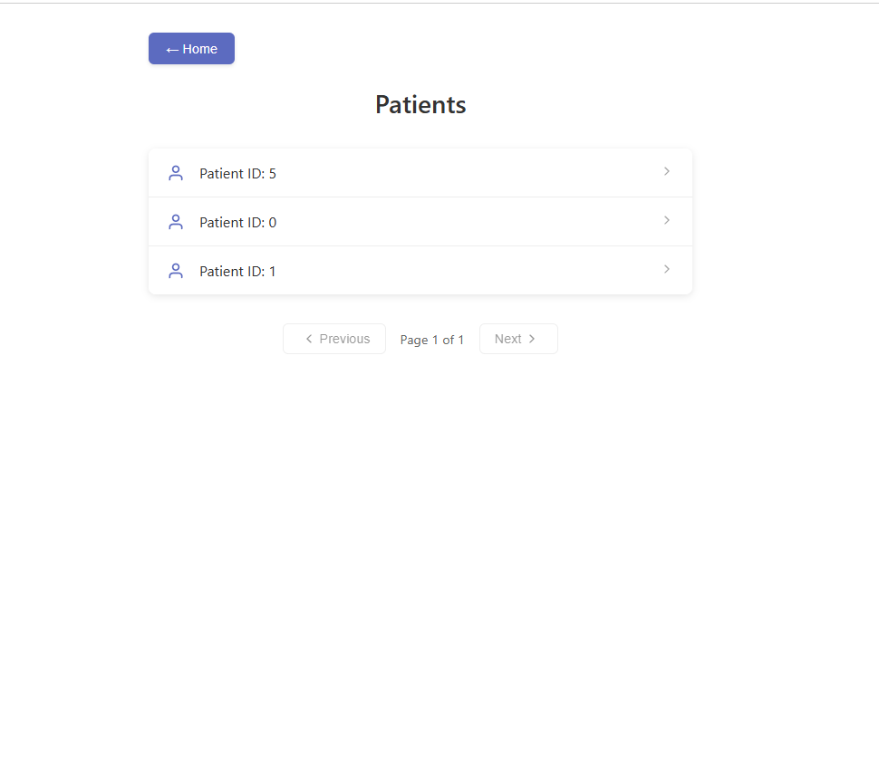
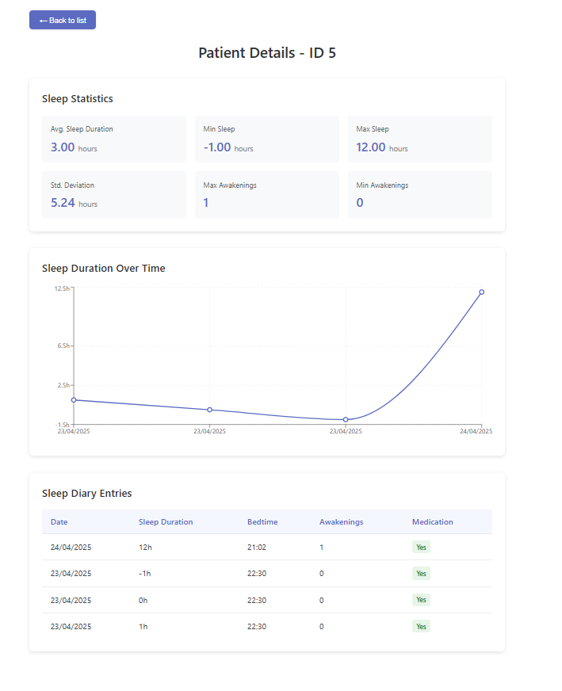

# 🛌 Sleep Diary - API + Frontend

Aplicação completa de Diário do Sono com frontend em React e backend em Flask.  
Pacientes podem registrar seus hábitos de sono e médicos acompanham estatísticas e histórico detalhado.

---


## Observações

A interface foi construída com um visual **clean e minimalista** por escolha proposital.  
O foco principal do projeto está na **estrutura de código e organização das camadas**, especialmente no backend, que segue os princípios da **Arquitetura Hexagonal**, com forte aplicação de **Programação Orientada a Objetos (POO)**, separando claramente:

- **Camadas de Domínio** (entidades, DTOs, casos de uso)
- **Infraestrutura** (repositórios, banco de dados)
- **Interface HTTP** (controllers com validação e documentação Swagger)
- **Application Layer** (orquestração dos casos de uso)

Essa separação busca demonstrar boas práticas de desenvolvimento, escalabilidade e facilidade de manutenção.

---

## Tecnologias Utilizadas

### Backend
- Python 3.10
- Flask + Flask-RESTX
- PostgreSQL (via Docker)
- Pandas (análises estatísticas)
- Docker + Docker Compose

### Frontend
- React 18+
- TypeScript
- Redux Toolkit
- Axios

---

##  Como rodar o projeto

### Pré-requisitos

Certifique-se de ter o Docker e Docker Compose instalados:

```bash
# Requisitos
Docker
Docker Compose
```

### Clone o repositório

```bash
git clone <repo-url>
cd app
```

### Rode os containers

```bash
docker-compose up --build
```

---

##  Acessos

- **Frontend:** http://localhost:3001
- **API Docs:** http://localhost:3035/docs

---

##  Endpoints disponíveis (via Swagger)

### Paciente

`POST /patient/` – Registrar nova entrada no diário de sono

**Payload de exemplo:**

```json
{
  "patient_id": 1,
  "sleep_duration": 7.5,
  "bedtime": "22:30",
  "awakenings": 1,
  "medication": false
}
```

### Médico

- `GET /doctor/patients` – Listar IDs únicos de pacientes
- `GET /doctor/patient/<id>/entries` – Histórico do paciente
- `GET /doctor/patient/<id>/stats` – Estatísticas gerais de sono

---

## Banco de dados

**PostgreSQL (rodando no container `diario_sono_postgres`)**

- Porta externa: `6543`
- Banco: `diario_sono`
- Usuário: `postgres`
- Senha: `postgres`

---

##  Estrutura de Diretórios

```bash
app/
├── backend/
│   ├── app/
│   │   ├── domain/
│   │   ├── infra/
│   │   ├── application/
│   │   ├── interface/
│   │   └── main.py
│   ├── requirements.txt
│   └── run.py
├── frontend/
│   ├── public/
│   ├── src/
│   │   ├── view/
│   │   ├── api/
│   │   └── App.tsx
│   ├── tailwind.config.js
│   ├── tsconfig.json
│   └── package.json
├── docker-compose.yml
```

---

## Funcionalidades

- Registro e listagem de entradas do paciente
- Estatísticas com média, mínimo, máximo e desvio padrão
- Gráficos de evolução
- Interface separada para paciente e médico
- Design responsivo com Tailwind + Styled Components

---

### 📸 Visual da Aplicação

#### Página Inicial


#### Formulário de Paciente


#### Lista de Pacientes


#### Detalhes do Paciente


